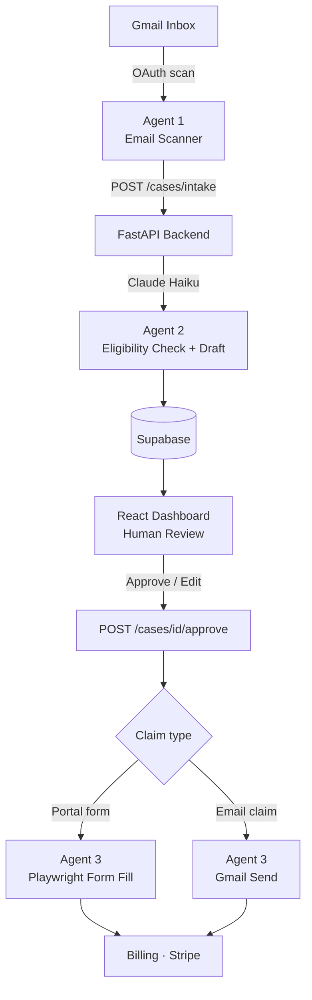

# CompensAI

CompensAI is an autonomous AI agent that monitors your Gmail inbox, detects compensation cases (flight delays, lost luggage, damaged parcels), checks your eligibility under EU law, drafts a formal claim, and submits it to the vendor on your behalf. You review and approve once — the rest is handled automatically.

🔗 [Devpost](https://devpost.com/software/compensai-choakb)

## Demo

> Click the thumbnail to watch the demo

[](https://www.youtube.com/watch?v=bpe9bpeoYO0)

## Architecture



## How it works

1. **Agent 1 — Scan:** Reads your Gmail inbox and identifies emails that may contain a compensation case (flight delay, lost luggage, damaged parcel, overcharge)
2. **Agent 2 — Analyse:** Claude checks eligibility against EU261/2004 and the Montreal Convention, estimates the claim value, and drafts a formal claim email or fills the vendor's web form
3. **You — Review:** A dashboard shows you the AI's reasoning, the draft claim, and any pre-filled form fields. You can edit and approve or reject
4. **Agent 3 — Submit:** Sends the email via Gmail or submits the vendor form headlessly via Playwright, records a video of the form being filled, calculates a 10% success fee, and generates a Stripe payment link

## Features

- **Inbox scanning:** Gmail OAuth integration, scans for flight delays, lost luggage, damaged parcels, and overcharges
- **Eligibility analysis:** Claude Haiku checks the claim against EU regulations and vendor policies, with reasoning shown to the user
- **Claim drafting:** Generates a formal compensation email or fills the vendor's web form with extracted case data
- **Human-in-the-loop:** Dashboard to review, edit fields, approve, or reject — nothing is sent without your explicit approval
- **Form recording:** Playwright records a video of the form being filled so you can verify what was submitted
- **Billing:** 10% success fee calculated on approval, Stripe Checkout link generated automatically

## Quick Start

> This project connects to your own accounts. You will need to set up your own API keys — none are included in this repository.

### Prerequisites

| Service | What you need | Link |
|---------|--------------|------|
| **Supabase** | Free project + service role key | [supabase.com](https://supabase.com) |
| **Anthropic** | API key | [console.anthropic.com](https://console.anthropic.com) |
| **Google Cloud** | OAuth 2.0 client ID (Desktop app) + Gmail API enabled | [console.cloud.google.com](https://console.cloud.google.com) |
| **Stripe** | Test secret key *(optional, for payment links only)* | [dashboard.stripe.com](https://dashboard.stripe.com) |

### Backend

```bash
cd backend
python -m venv venv
source venv/bin/activate        # Windows: venv\Scripts\activate
pip install -r requirements.txt
playwright install chromium
cp .env.example .env            # fill in your keys
uvicorn app.main:app --reload --port 8000
```

### Gmail OAuth (one-time per Google account)

```bash
# 1. Download client_secret.json from Google Cloud Console
#    APIs & Services → Credentials → OAuth 2.0 Client ID → Desktop App
# 2. Place it in backend/
# 3. Run:
python scripts/gmail_auth.py
# Opens a browser → sign in → gmail_token.json is saved automatically
```

### Frontend

```bash
cd frontend
npm install
npm run dev                     # http://localhost:5173
```

## Environment Variables

Create `backend/.env`:

```env
SUPABASE_URL=https://xxxx.supabase.co
SUPABASE_SERVICE_ROLE_KEY=...

ANTHROPIC_API_KEY=sk-ant-...
ANTHROPIC_MODEL=claude-haiku-4-5-20251001

ADMIN_API_KEY=your-secret

GMAIL_CREDENTIALS_FILE=client_secret.json
GMAIL_TOKEN_FILE=gmail_token.json

STRIPE_SECRET_KEY=sk_test_...        # optional
STRIPE_SUCCESS_URL=https://your-domain.com/success
STRIPE_CANCEL_URL=https://your-domain.com/cancel

CORS_ORIGINS=http://localhost:5173
```

## Project Structure

```
compensation-agent/
├── backend/
│   ├── app/
│   │   ├── core/           # config, security
│   │   ├── db/             # Supabase client
│   │   ├── repositories/   # DB queries
│   │   ├── routers/        # API endpoints (cases, gmail)
│   │   └── services/       # agent2 (LLM), form_filler, billing
│   ├── scripts/
│   │   └── gmail_auth.py   # one-time Gmail OAuth setup
│   └── requirements.txt
└── frontend/
    └── src/
        ├── pages/          # Dashboard, DisputeDetail, Landing
        └── components/     # HITLActionBlock, AgentTimeline, etc.
```
