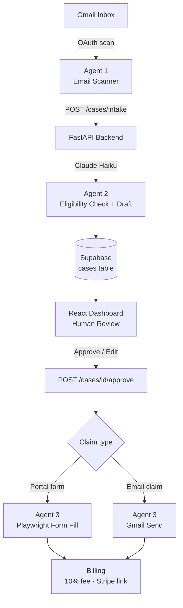

# CompensAI

An AI agent that automatically detects compensation opportunities in your inbox, drafts formal claims, and submits them to vendors — with a human-in-the-loop approval step before anything is sent.

🔗 [Devpost](https://devpost.com/software/compensai-choakb)

---

## Demo

[](https://www.youtube.com/watch?v=bpe9bpeoYO0)

---

## Architecture



---

## Features

- **Inbox scanning:** Connects to Gmail via OAuth, scans for flight delays, lost luggage, damaged parcels, and overcharges
- **Eligibility analysis:** Claude checks the email against EU261/2004, Montreal Convention, and vendor policies
- **Claim drafting:** Generates a formal compensation email or fills the vendor's web form using Playwright
- **Human-in-the-loop:** Dashboard lets you review, edit, approve, or reject each claim before submission
- **Automated submission:** Sends the email via Gmail or submits the form headlessly with video recording
- **Billing:** Calculates a 10% success fee and generates a Stripe payment link on approval

---

## Quick Start

> **Important:** Each person running this project needs their own API credentials (see [Prerequisites](#prerequisites)). No keys are stored in this repository.

### Prerequisites

| Service | What you need | Link |
|---------|--------------|------|
| **Supabase** | Free project + service role key | [supabase.com](https://supabase.com) |
| **Anthropic** | API key | [console.anthropic.com](https://console.anthropic.com) |
| **Google Cloud** | OAuth 2.0 client ID (Desktop app) + Gmail API enabled | [console.cloud.google.com](https://console.cloud.google.com) |
| **Stripe** | Test secret key *(optional — only for payment links)* | [dashboard.stripe.com](https://dashboard.stripe.com) |

### Backend

```bash
cd backend

python -m venv venv
source venv/bin/activate        # Windows: venv\Scripts\activate
pip install -r requirements.txt
playwright install chromium

cp .env.example .env            # fill in your keys (see below)
uvicorn app.main:app --reload --port 8000
```

### Gmail OAuth (one-time per Google account)

```bash
# 1. Download client_secret.json from Google Cloud Console
#    APIs & Services → Credentials → OAuth 2.0 Client ID → Desktop App
# 2. Place it in backend/
# 3. Run:
python scripts/gmail_auth.py
# Opens a browser → sign in with your Google account → gmail_token.json is saved
```

### Frontend

```bash
cd frontend
npm install
npm run dev                     # runs on http://localhost:5173
```

---

## Environment Variables

Create `backend/.env`:

```env
# Supabase
SUPABASE_URL=https://xxxx.supabase.co
SUPABASE_SERVICE_ROLE_KEY=...

# Anthropic Claude
ANTHROPIC_API_KEY=sk-ant-...
ANTHROPIC_MODEL=claude-haiku-4-5-20251001

# Auth (used for dashboard → backend calls)
ADMIN_API_KEY=your-secret

# Gmail OAuth
GMAIL_CREDENTIALS_FILE=client_secret.json
GMAIL_TOKEN_FILE=gmail_token.json

# Stripe (optional)
STRIPE_SECRET_KEY=sk_test_...
STRIPE_SUCCESS_URL=https://your-domain.com/success
STRIPE_CANCEL_URL=https://your-domain.com/cancel

# CORS
CORS_ORIGINS=http://localhost:5173
```

---

## Project Structure

```
compensation-agent/
├── backend/
│   ├── app/
│   │   ├── core/           # config, security
│   │   ├── db/             # Supabase client
│   │   ├── repositories/   # DB queries
│   │   ├── routers/        # API endpoints (cases, gmail)
│   │   └── services/       # agent2 (LLM), form_filler, billing
│   ├── scripts/
│   │   └── gmail_auth.py   # one-time Gmail OAuth setup
│   └── requirements.txt
└── frontend/
    └── src/
        ├── pages/          # Dashboard, DisputeDetail, Landing
        └── components/     # HITLActionBlock, AgentTimeline, etc.
```
